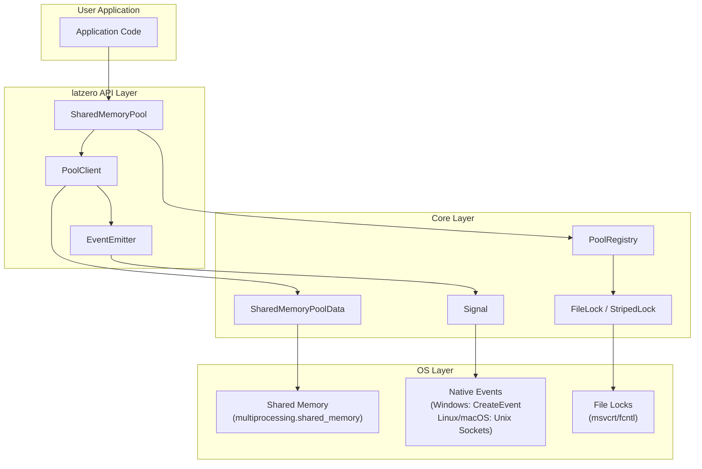
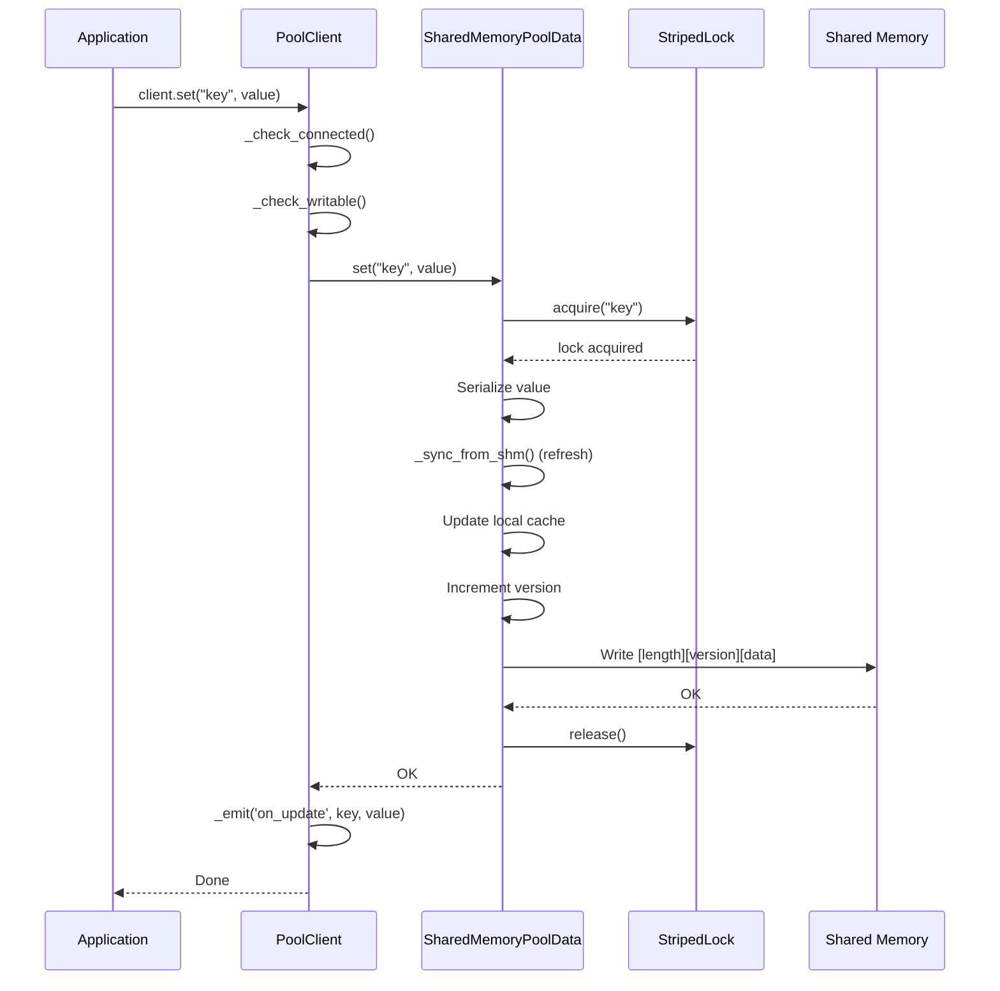
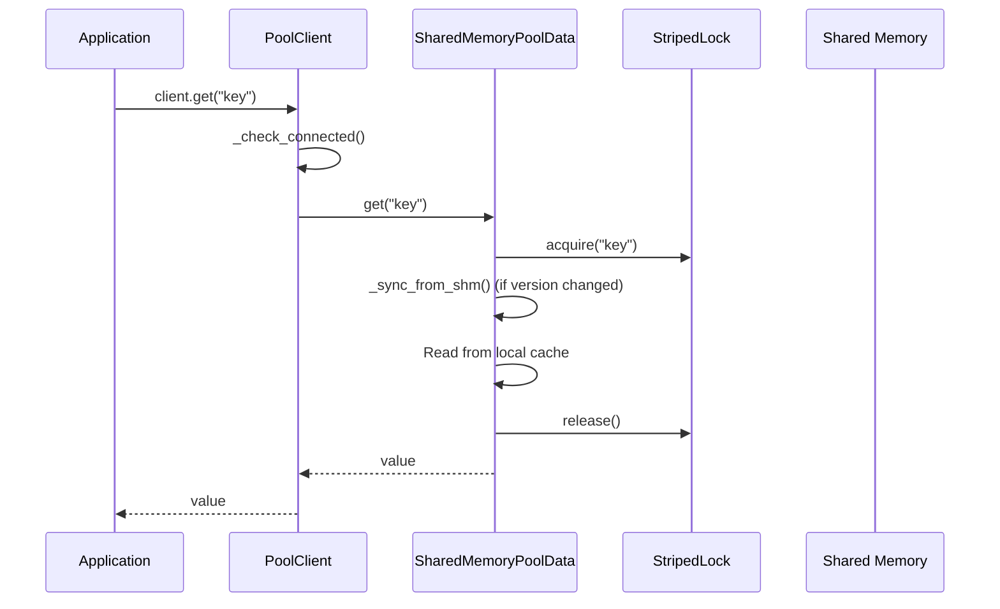
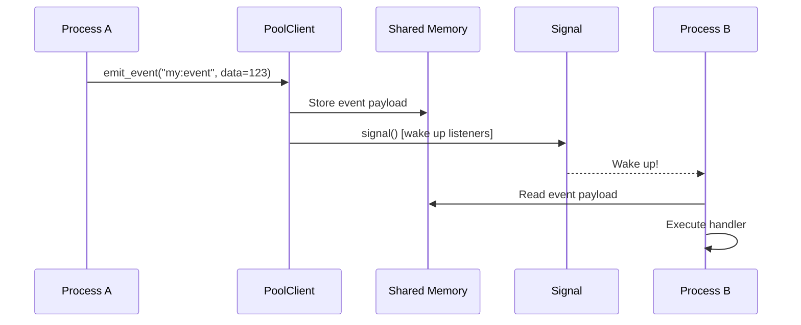
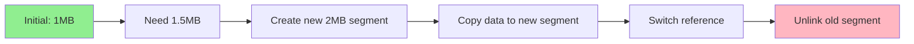
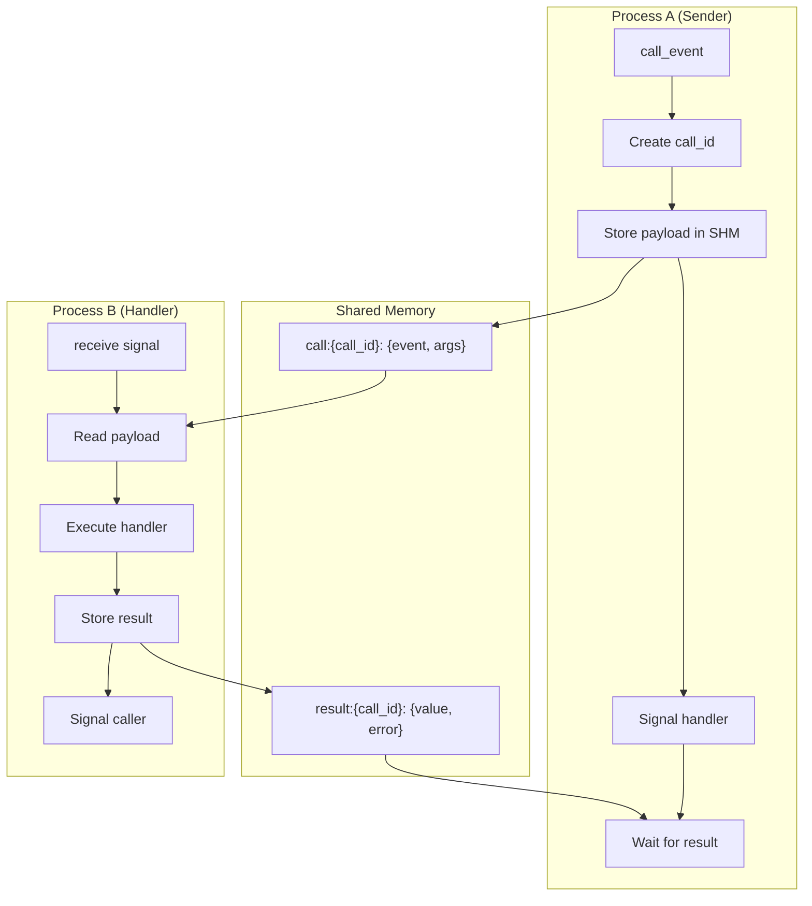

# latzero Engineering Documentation

> **Zero-latency, zero-fuss shared memory for Python.**
> Dynamic, encrypted, and insanely fast inter-process communication.

---

## Table of Contents

1. [Overview](#overview)
2. [Architecture](#architecture)
3. [Core Components](#core-components)
4. [Data Flow](#data-flow)
5. [Cross-Platform Signal Mechanisms](#cross-platform-signal-mechanisms)
6. [Memory Layout](#memory-layout)
7. [Event System](#event-system)
8. [Locking & Concurrency](#locking--concurrency)
9. [Serialization](#serialization)
10. [Performance Characteristics](#performance-characteristics)
11. [API Reference](#api-reference)
12. [Usage Examples](#usage-examples)
13. [Benchmarks](#benchmarks)

---

## Overview

**latzero** is a high-performance shared memory IPC (Inter-Process Communication) library for Python that achieves **microsecond-level latency** across Windows, Linux, and macOS.

### Key Features

| Feature            | Description                                      |
| ------------------ | ------------------------------------------------ |
| **Ultra-Fast**     | Sub-100μs latency for get/set operations         |
| **Cross-Platform** | Native performance on Windows, Linux, macOS      |
| **Dynamic Memory** | Auto-expanding shared memory (1MB → 100MB)       |
| **Encryption**     | Optional AES-256-GCM encryption                  |
| **Events**         | Socket-like event system with emit/call patterns |
| **Type Safety**    | Full typing support with `py.typed` marker       |

### Performance Summary

```
Platform     | EMIT Median | CALL Median | Throughput
-------------|-------------|-------------|------------
Windows      | ~21 μs      | ~49 μs      | 24K ops/sec
Linux        | ~53 μs      | ~166 μs     | 17K ops/sec
macOS        | ~50 μs      | ~150 μs     | 15K ops/sec
```

---

## Architecture



### Component Hierarchy

```
latzero/
├── __init__.py          # Public API exports
├── core/
│   ├── pool.py          # SharedMemoryPool, PoolClient, NamespacedClient
│   ├── memory.py        # SharedMemoryPoolData, Serializer
│   ├── registry.py      # PoolRegistry (global index table)
│   ├── events.py        # EventEmitter, Signal classes
│   ├── events_types.py  # Event modes, errors, payloads
│   ├── events_metrics.py# Event performance tracking
│   ├── locking.py       # FileLock, StripedLock, ReadWriteLock
│   ├── encryption.py    # AES-256-GCM encryption
│   └── cleanup.py       # Background cleanup daemon
├── async_api/
│   └── pool.py          # Async wrappers
├── persistence/
│   └── snapshot.py      # Pool snapshots to disk
├── cli/
│   └── main.py          # Command-line interface
└── utils/
    ├── exceptions.py    # Custom exceptions
    ├── logging.py       # Logging configuration
    ├── serializer.py    # Serialization utilities
    └── type_checker.py  # Runtime type validation
```

---

## Core Components

### 1. SharedMemoryPool

The main entry point for creating and connecting to shared memory pools.

```python
class SharedMemoryPool:
    """
    Main API class for managing shared memory pools.

    Responsibilities:
    - Create new pools with optional auth/encryption
    - Connect clients to existing pools
    - Manage pool lifecycle (destroy, list, stats)
    """

    def create(name, auth=False, auth_key='', encryption=False, ttl=None) -> bool
    def connect(name, auth_key='', readonly=False) -> PoolClient
    def destroy(name) -> bool
    def exists(name) -> bool
    def list_pools() -> Dict[str, dict]
    def stats() -> dict
    def close(force=False) -> None
```

### 2. PoolClient

Client interface for interacting with pool data.

```python
class PoolClient:
    """
    Client for interacting with a shared memory pool.

    Features:
    - Key-value storage (set/get/delete)
    - Batch operations (set_fast/flush)
    - Events (on_event, emit_event, call_event)
    - Namespacing support
    """

    # Data operations
    def set(key, value, auto_clean=None) -> None
    def set_fast(key, value, auto_clean=None) -> None  # No sync
    def flush() -> None  # Sync batched writes
    def get(key, default=None) -> Any
    def get_many(keys) -> Dict[str, Any]
    def delete(key) -> bool
    def delete_many(keys) -> int
    def exists(key) -> bool
    def keys(pattern=None) -> List[str]

    # Events
    def on_event(event, mode=EventMode.FIRST) -> decorator
    def emit_event(event, **kwargs) -> None
    def call_event(event, _timeout=5.0, **kwargs) -> Any
```

### 3. PoolRegistry

Global index table tracking all active pools.

```python
class PoolRegistry:
    """
    Thread-safe AND process-safe registry using shared memory + FileLock.

    Storage format:
    {
        "pools": {
            "pool_name": {
                "auth": bool,
                "auth_key": str,
                "encryption": bool,
                "clients": int,
                "created": float,
                "last_activity": float,
                "ttl": Optional[int]
            }
        },
        "pools_data_keys": {
            "pool_name": "l0p_pool_name"  # Shared memory segment name
        }
    }
    """
```

### 4. SharedMemoryPoolData

Low-level shared memory data management.

```python
class SharedMemoryPoolData:
    """
    Manages data storage in shared memory with:
    - Dynamic expansion (1MB → 100MB)
    - Version-based cache invalidation
    - Per-key locking with StripedLock
    """

    INITIAL_SIZE = 1024 * 1024      # 1MB
    MAX_SIZE = 100 * 1024 * 1024    # 100MB
    HEADER_SIZE = 16                 # 8 bytes length + 8 bytes version
```

---

## Data Flow

### Write Operation (set)



### Read Operation (get)



### Event Flow (emit_event)



---

## Cross-Platform Signal Mechanisms

The signaling system is critical for event performance. latzero uses **platform-native primitives** for minimal latency:

### Windows: Named Events

```python
class WindowsSignal:
    """
    Uses Windows kernel events via ctypes:
    - CreateEventW: Create named event
    - SetEvent: Signal the event (~1-10μs)
    - WaitForSingleObject: Wait for signal
    """

    def signal(self):
        kernel32.SetEvent(self._handle)

    def wait(self, timeout_ms=-1):
        result = kernel32.WaitForSingleObject(self._handle, wait_time)
        return result == WAIT_OBJECT_0
```

### Linux: Unix Domain Sockets

```python
class LinuxEventFD:
    """
    Uses Unix domain sockets for cross-process signaling:
    - AF_UNIX + SOCK_DGRAM for fast datagram delivery
    - Non-blocking with select() for multiplexing
    - ~1-5μs latency
    """

    def __init__(self, name, create=True):
        self._sock_path = f"/tmp/latzero_sig_{name}.sock"
        self._sock = socket.socket(socket.AF_UNIX, socket.SOCK_DGRAM)
        self._sock.setblocking(False)
        self._sock.bind(self._sock_path)

    def signal(self):
        self._sock.sendto(b'1', self._sock_path)

    def wait(self, timeout_ms=-1):
        readable, _, _ = select.select([self._sock], [], [], timeout)
        if readable:
            self._sock.recv(64)
            return True
        return False

    def fileno(self):
        return self._sock.fileno()  # For select() multiplexing
```

### macOS: Unix Domain Sockets

```python
class MacOSSignal:
    """
    Same approach as Linux - Unix domain sockets.
    ~5-20μs latency on macOS.
    """
```

### Listener Loop Optimization

The listener uses `select()` to monitor ALL signals with a single syscall:

```python
def _listener_loop_select(self, select_module):
    """
    Fast listener using select() - O(1) wake-up time.

    OLD (slow): Poll each signal with 10ms timeout
        Worst case: N signals × 10ms = N×10ms latency

    NEW (fast): select() on all file descriptors
        Wake up INSTANTLY when any signal fires
    """
    while self._listener_running:
        fds = [sig for sig in self._signals.values()]

        # Single syscall monitors ALL signals
        readable, _, _ = select.select(fds, [], [], 0.1)

        for sig in readable:
            event = fd_to_event.get(sig.fileno())
            self._process_pending_calls(event)  # Instant!
```

### Signal Comparison

| Platform | Mechanism               | Latency    | Notes                         |
| -------- | ----------------------- | ---------- | ----------------------------- |
| Windows  | Named Events (kernel32) | ~1-10μs    | Fastest, native kernel events |
| Linux    | Unix Domain Sockets     | ~1-5μs     | Fast, select() compatible     |
| macOS    | Unix Domain Sockets     | ~5-20μs    | Fast, select() compatible     |
| Fallback | posix_ipc.Semaphore     | ~100μs-1ms | Slower, used if sockets fail  |

---

## Memory Layout

### Shared Memory Structure

```
+----------------+----------------+---------------------------+
| Length (8B)    | Version (8B)   | Serialized Data (N bytes) |
+----------------+----------------+---------------------------+
|<-- HEADER_SIZE = 16 bytes -->|<-- Variable length ------->|
```

### Data Format

The serialized data is a dictionary:

```python
{
    "key1": {
        "value": <serialized_value>,
        "expires": Optional[float],  # Unix timestamp
        "created": float,
        "modified": float
    },
    "key2": { ... },
    ...
}
```

### Dynamic Expansion



```python
def _expand_memory(self, needed_size):
    """
    Strategy: Create new segment, copy data, switch over.

    Growth factor: 2x current size, up to MAX_SIZE
    """
    new_size = min(self._current_size * 2, self.MAX_SIZE)
    while new_size < needed_size:
        new_size = min(new_size * 2, self.MAX_SIZE)

    # Create new, larger segment
    new_shm = shm.SharedMemory(name=f"{self.shm_name}_new",
                                create=True, size=new_size)

    # Copy existing data
    new_shm.buf[:len(data)] = data

    # Atomic switch
    old_shm = self.shm
    self.shm = new_shm

    # Cleanup old
    old_shm.close()
    old_shm.unlink()
```

---

## Event System

The event system provides socket-like communication between processes.

### Event Modes

```python
class EventMode(Enum):
    FIRST = "first"           # First registered handler wins
    ROUND_ROBIN = "round_robin"  # Load balance across handlers
    BROADCAST = "broadcast"   # All handlers receive (emit only)
```

### Event Registration

```python
@client.on_event("user:created", mode=EventMode.FIRST)
def handle_user_created(name: str, email: str):
    """Handler receives kwargs from caller."""
    return {"status": "ok", "user_id": 123}
```

### Event Flow Diagram



### emit vs call

| Method         | Pattern              | Blocking | Returns              |
| -------------- | -------------------- | -------- | -------------------- |
| `emit_event()` | Fire-and-forget      | No       | None                 |
| `call_event()` | RPC/Request-Response | Yes      | Handler return value |

---

## Locking & Concurrency

### FileLock (Inter-Process)

Cross-platform file locking for process-level synchronization:

```python
class FileLock:
    """
    Uses OS-native file locking:
    - Windows: msvcrt.locking()
    - Unix: fcntl.flock()

    Performance: ~1-5μs acquire/release
    """

    def acquire(self, blocking=True, timeout=-1):
        if sys.platform == 'win32':
            msvcrt.locking(self._fd, msvcrt.LK_LOCK, 1)
        else:
            fcntl.flock(self._fd, fcntl.LOCK_EX)

    def release(self):
        if sys.platform == 'win32':
            msvcrt.locking(self._fd, msvcrt.LK_UNLCK, 1)
        else:
            fcntl.flock(self._fd, fcntl.LOCK_UN)
```

### StripedLock (Per-Key)

Hash-based lock striping for fine-grained concurrency:

```python
class StripedLock:
    """
    Instead of one lock per key (memory expensive), hash keys
    to a fixed number of lock stripes.

    Default: 64 stripes
    Collision rate: ~1.5% with 1000 keys
    """

    def __init__(self, num_stripes=64):
        self._stripes = [threading.Lock() for _ in range(num_stripes)]

    def _get_stripe(self, key: str) -> int:
        """FNV-1a hash variant for fast key → stripe mapping."""
        h = 2166136261
        for c in key.encode():
            h ^= c
            h = (h * 16777619) & 0xFFFFFFFF
        return h % self._num_stripes

    @contextmanager
    def acquire(self, key: str):
        stripe = self._get_stripe(key)
        self._stripes[stripe].acquire()
        try:
            yield
        finally:
            self._stripes[stripe].release()
```

### Lock Hierarchy

```
┌─────────────────────────────────────────────────────┐
│ Level 1: FileLock (Registry)                        │
│   - Global registry operations                      │
│   - Pool creation/destruction                       │
│   - One lock per process                            │
├─────────────────────────────────────────────────────┤
│ Level 2: threading.RLock (SharedMemoryPoolData)     │
│   - Per-pool data structure                         │
│   - Thread-safe within process                      │
├─────────────────────────────────────────────────────┤
│ Level 3: StripedLock (Per-Key)                      │
│   - Fine-grained key locking                        │
│   - 64 stripes by default                           │
│   - Minimal contention                              │
└─────────────────────────────────────────────────────┘
```

---

## Serialization

### Serializer Class

```python
class Serializer:
    """
    Fast serializer with msgpack default, pickle fallback.

    msgpack is ~3-5x faster than pickle for common types.
    Falls back to pickle for complex Python objects.
    """

    def __init__(self, prefer_msgpack=True, compress_threshold=10240):
        self._use_msgpack = prefer_msgpack and HAS_MSGPACK
        self._compress_threshold = compress_threshold

    def serialize(self, obj):
        if self._use_msgpack:
            try:
                data = msgpack.packb(obj, use_bin_type=True)
            except (TypeError, ValueError):
                # Complex object - fall back to pickle
                data = b'\x01' + pickle.dumps(obj)
        else:
            data = b'\x01' + pickle.dumps(obj)

        # Compress if large
        if self._compress_threshold > 0 and len(data) > self._compress_threshold:
            compressed = zlib.compress(data)
            if len(compressed) < len(data):
                return b'\x02' + compressed

        return data
```

### Data Format Prefixes

| Prefix | Format                   |
| ------ | ------------------------ |
| `\x00` | msgpack (default)        |
| `\x01` | pickle (complex objects) |
| `\x02` | zlib compressed          |

### Benchmarks

```
Serializer     | Serialize | Deserialize | Notes
---------------|-----------|-------------|-------
msgpack        | ~2 μs     | ~1 μs       | Default for JSON-like data
pickle         | ~8 μs     | ~5 μs       | Fallback for complex objects
+compression   | +50 μs    | +30 μs      | Only for data > 10KB
```

---

## Performance Characteristics

### Latency Breakdown

```
Operation              | Time      | Notes
-----------------------|-----------|------------------
StripedLock acquire    | ~0.1 μs   | Thread lock
Serialization (msgpack)| ~1-5 μs   | Depends on size
Memory copy            | ~0.5 μs   | For small values
FileLock (if needed)   | ~1-5 μs   | Inter-process only
Signal (Windows)       | ~1-10 μs  | Kernel event
Signal (Linux/macOS)   | ~5-20 μs  | Unix socket
Total SET              | ~10-50 μs | Typical case
Total GET              | ~1-5 μs   | Cache hit
```

### Throughput Limits

| Operation | Throughput     | Bottleneck           |
| --------- | -------------- | -------------------- |
| SET       | 2-3K ops/sec   | Serialization + sync |
| SET_FAST  | 100K+ ops/sec  | No sync overhead     |
| GET       | 2M+ ops/sec    | Memory read speed    |
| EMIT      | 15-25K ops/sec | Signal overhead      |
| CALL      | 5-10K ops/sec  | Round-trip latency   |

### Memory Usage

```
Component          | Memory
-------------------|--------
Registry           | 1 MB (fixed)
Pool (initial)     | 1 MB
Pool (max)         | 100 MB
Lock files         | ~4 KB each
Signal sockets     | ~1 KB each
```

---

## API Reference

### Core Classes

```python
from latzero import SharedMemoryPool, PoolClient

# Create/manage pools
pool = SharedMemoryPool(auto_cleanup=True)
pool.create("myPool", auth=True, auth_key="secret", encryption=True, ttl=3600)
pool.destroy("myPool")
pool.exists("myPool")
pool.list_pools()
pool.stats()
pool.close(force=True)

# Connect to pool
client = pool.connect("myPool", auth_key="secret", readonly=False)

# Data operations
client.set("key", {"data": [1, 2, 3]}, auto_clean=60)
client.set_fast("key", value)  # No immediate sync
client.flush()                  # Sync batched writes
value = client.get("key", default=None)
values = client.get_many(["k1", "k2", "k3"])
client.delete("key")
client.delete_many(["k1", "k2"])
client.exists("key")
keys = client.keys(pattern="user:")
client.clear()

# Disconnect
client.disconnect()
```

### Events

```python
# Register handler
@client.on_event("task:created", mode=EventMode.ROUND_ROBIN)
def handle_task(task_id: str, data: dict) -> dict:
    return {"processed": True}

# Start listening
client.listen()

# Fire-and-forget
client.emit_event("task:created", task_id="123", data={"name": "Test"})

# RPC call
result = client.call_event("task:created", task_id="123", data={"name": "Test"}, _timeout=5.0)

# Stop
client.stop_events()
```

### Configuration

```python
from latzero import configure_serializer, configure_logging

# Serialization
configure_serializer(prefer_msgpack=True, compress_threshold=10240)

# Logging
configure_logging(level="DEBUG")
```

### Exceptions

```python
from latzero import (
    LatzeroError,           # Base exception
    PoolNotFound,           # Pool doesn't exist
    PoolExistsError,        # Pool already exists
    AuthenticationError,    # Wrong auth key
    EncryptionError,        # Encryption/decryption failed
    MemoryFullError,        # Pool at max size
    ReadOnlyError,          # Write on readonly connection
    PoolDisconnectedError,  # Client disconnected
    EventError,             # Event handler error
    EventTimeout,           # RPC timeout
)
```

---

## Usage Examples

### Basic Shared Memory

```python
from latzero import SharedMemoryPool

# Process A: Create and write
pool = SharedMemoryPool()
pool.create("cache")

with pool.connect("cache") as client:
    client.set("user:123", {"name": "Alice", "age": 30})
    print(f"Stored: {client.get('user:123')}")

# Keep pool alive or destroy
# pool.destroy("cache")
```

```python
# Process B: Connect and read
from latzero import SharedMemoryPool

pool = SharedMemoryPool()
with pool.connect("cache") as client:
    user = client.get("user:123")
    print(f"Retrieved: {user}")  # {'name': 'Alice', 'age': 30}
```

### High-Performance Batch Operations

```python
from latzero import SharedMemoryPool

pool = SharedMemoryPool()
pool.create("batch_demo")

with pool.connect("batch_demo") as client:
    # Slow: sync after each write
    for i in range(1000):
        client.set(f"key_{i}", i)

    # Fast: batch writes, single sync
    for i in range(1000):
        client.set_fast(f"fast_key_{i}", i)
    client.flush()  # Single sync at the end

pool.destroy("batch_demo")
```

### Event-Driven Architecture

```python
# worker.py - Event handler
from latzero import SharedMemoryPool, EventMode

pool = SharedMemoryPool()
pool.create("events_demo")

with pool.connect("events_demo") as client:
    @client.on_event("task:process", mode=EventMode.ROUND_ROBIN)
    def process_task(task_id: str, payload: dict) -> dict:
        # Process the task
        result = {"task_id": task_id, "status": "completed"}
        return result

    client.listen()
    print("Worker listening...")

    import time
    while True:
        time.sleep(1)
```

```python
# dispatcher.py - Event sender
from latzero import SharedMemoryPool

pool = SharedMemoryPool()

with pool.connect("events_demo") as client:
    # Fire-and-forget (async)
    client.emit_event("task:process", task_id="456", payload={"data": "test"})

    # RPC call (sync, waits for response)
    result = client.call_event(
        "task:process",
        task_id="789",
        payload={"data": "important"},
        _timeout=5.0
    )
    print(f"Result: {result}")  # {'task_id': '789', 'status': 'completed'}
```

### Encrypted Pool

```python
from latzero import SharedMemoryPool

pool = SharedMemoryPool()
pool.create("secure_pool", auth=True, auth_key="my-secret-key", encryption=True)

# Connect with auth
with pool.connect("secure_pool", auth_key="my-secret-key") as client:
    client.set("sensitive_data", {"ssn": "123-45-6789"})
    data = client.get("sensitive_data")
    print(f"Decrypted: {data}")

pool.destroy("secure_pool")
```

### Auto-Expiring Keys

```python
from latzero import SharedMemoryPool
import time

pool = SharedMemoryPool()
pool.create("ttl_demo")

with pool.connect("ttl_demo") as client:
    # Key expires after 5 seconds
    client.set("temp_key", "temporary value", auto_clean=5)

    print(client.get("temp_key"))  # "temporary value"
    time.sleep(6)
    print(client.get("temp_key"))  # None (expired)

pool.destroy("ttl_demo")
```

### Namespaced Client

```python
from latzero import SharedMemoryPool

pool = SharedMemoryPool()
pool.create("namespaced_demo")

with pool.connect("namespaced_demo") as client:
    # Create namespaced client
    users = client.namespace("users")
    products = client.namespace("products")

    # Keys are automatically prefixed
    users.set("123", {"name": "Alice"})
    products.set("456", {"name": "Widget"})

    # Actual keys in pool:
    # "users:123" -> {"name": "Alice"}
    # "products:456" -> {"name": "Widget"}

    print(users.get("123"))      # {"name": "Alice"}
    print(products.get("456"))   # {"name": "Widget"}

pool.destroy("namespaced_demo")
```

---

## Benchmarks

### Running Benchmarks

```bash
# Full benchmark suite
python -m tests.test_events_latency

# Quick latency test
python -c "
import time
from latzero import SharedMemoryPool

pool = SharedMemoryPool()
pool.create('bench')
c = pool.connect('bench')

# Warmup
for i in range(100):
    c.set_fast('k', i)
c.flush()

# Benchmark
n = 1000
start = time.perf_counter_ns()
for i in range(n):
    c.set_fast('k', i)
c.flush()
elapsed = time.perf_counter_ns() - start

print(f'{n} ops in {elapsed/1e6:.2f}ms = {elapsed/n/1000:.1f}μs/op')

c.disconnect()
pool.destroy('bench')
pool.close(force=True)
"
```

### Expected Results

```
============================================================
       latzero Events System Benchmark
============================================================

  Configuration:
    Warmup iterations:     100
    Latency iterations:    10,000
    Throughput iterations: 50,000

============================================================
  BASELINE: set/get Performance
============================================================
    SET rate: 2.9K ops/sec
    GET rate: 2.2M ops/sec

============================================================
  EMIT Latency Test (Fire-and-Forget)
============================================================
    Min:     10-30 μs
    Median:  20-55 μs
    P95:     40-75 μs
    P99:     90-900 μs

============================================================
  CALL Latency Test (RPC Round-trip)
============================================================
    Min:     40-130 μs
    Median:  50-170 μs
    P95:     180-210 μs
    P99:     250-450 μs

============================================================
  Benchmark Complete!
============================================================
```

---

## Troubleshooting

### Common Issues

#### 1. Resource Tracker Warning (Linux/macOS)

```
UserWarning: resource_tracker: There appear to be 1 leaked shared_memory objects
```

**Solution:** Call `pool.close(force=True)` when completely done:

```python
pool = SharedMemoryPool()
try:
    # ... your code ...
finally:
    pool.close(force=True)
```

#### 2. Pool Not Found

```python
latzero.PoolNotFound: Pool 'myPool' does not exist
```

**Solution:** Create the pool first, or check if it exists:

```python
if not pool.exists("myPool"):
    pool.create("myPool")
```

#### 3. Socket File Exists (Linux/macOS)

If signal sockets aren't cleaned up properly:

```bash
rm /tmp/latzero_sig_*.sock
```

#### 4. Authentication Error

```python
latzero.AuthenticationError: Invalid authentication key
```

**Solution:** Use the correct auth_key when connecting:

```python
pool.connect("secure_pool", auth_key="correct-key")
```

---

## Contributing

### Development Setup

```bash
git clone https://github.com/Latency-Zero/python-client
cd python-client
python -m venv .venv
source .venv/bin/activate  # or .venv\Scripts\activate on Windows
pip install -e ".[dev]"
```

### Running Tests

```bash
pytest tests/
python -m tests.test_events_latency
```

### Building

```bash
pip install build twine
python -m build
```

---

## License

MIT License - see [LICENSE](LICENSE) for details.

---

_Last updated: 2026-01-30 | latzero v0.3.1_